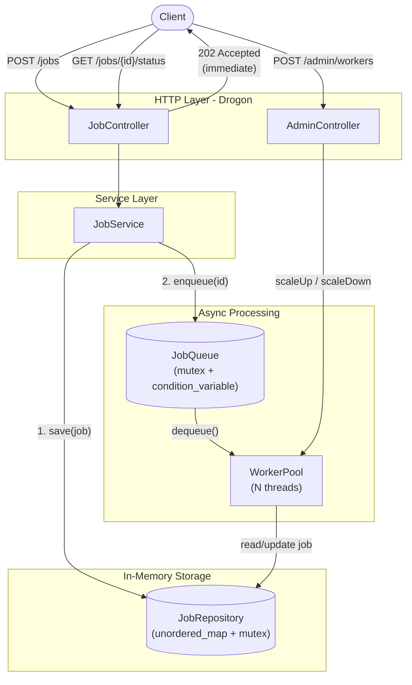
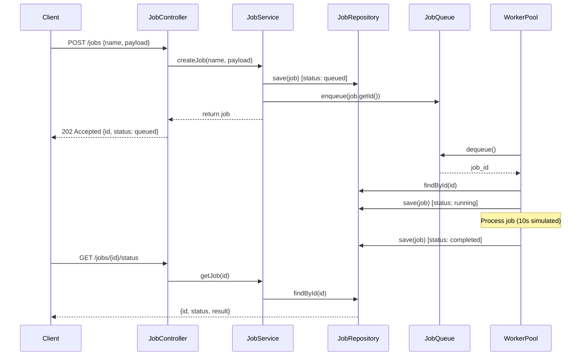
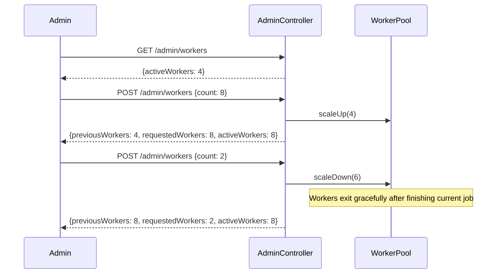
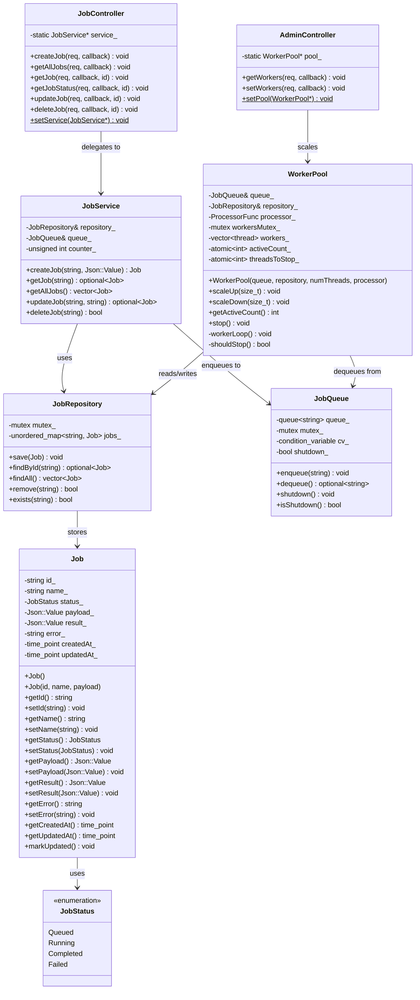
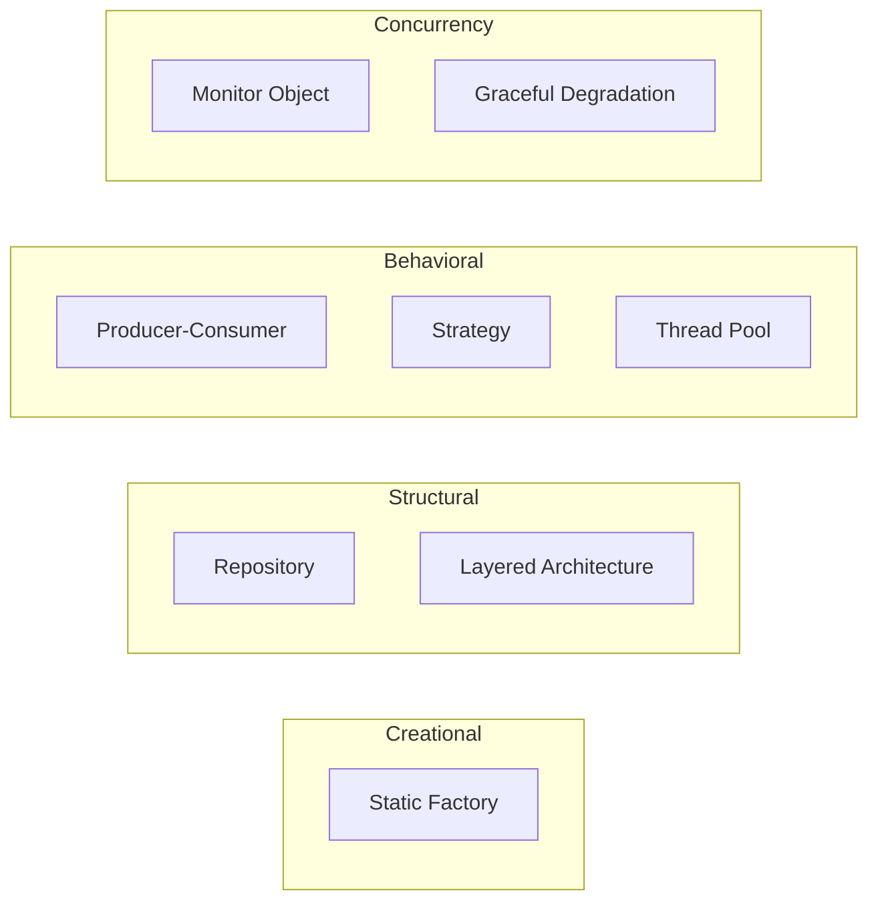
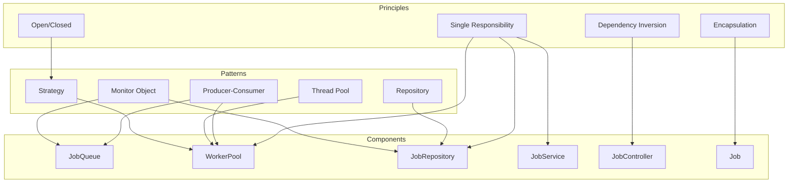
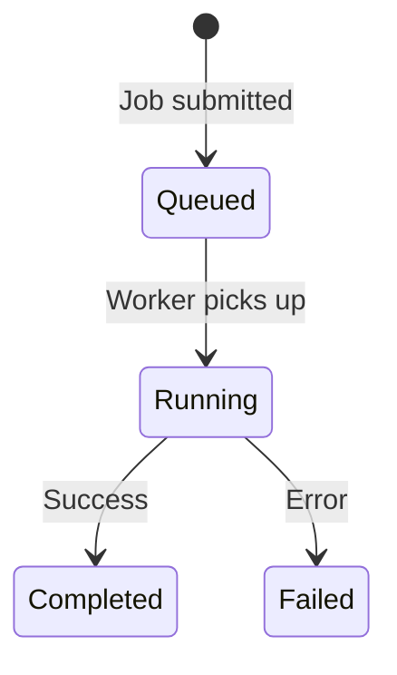
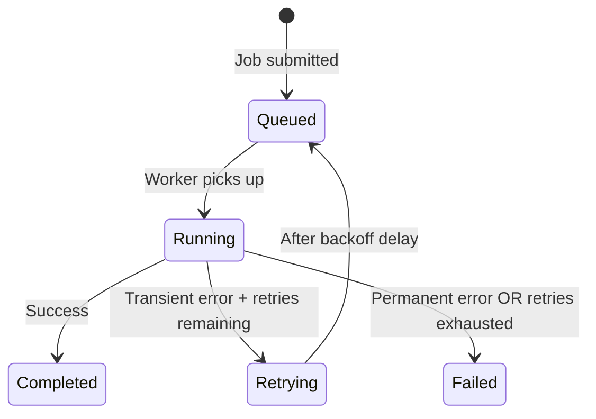
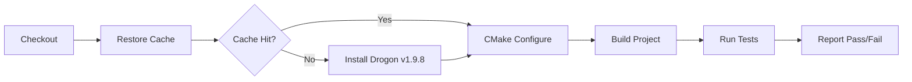

# AsyncJobScheduler -- Official Documentation

> **Version:** 1.0  
> **Last Updated:** July 2026  
> **Framework:** Drogon (C++20)  
> **License:** MIT

---

## Table of Contents

1. [Introduction](#1-introduction)
2. [Architecture](#2-architecture)
   - 2.1 [System Overview](#21-system-overview)
   - 2.2 [Request Flow](#22-request-flow)
   - 2.3 [Dynamic Scaling Flow](#23-dynamic-scaling-flow)
   - 2.4 [Class Diagram](#24-class-diagram)
3. [Design Patterns & Principles](#3-design-patterns--principles)
   - 3.1 [Patterns Used](#31-patterns-used)
   - 3.2 [Design Patterns](#32-design-patterns)
   - 3.3 [Design Principles](#33-design-principles)
   - 3.4 [How They Connect](#34-how-they-connect)
4. [Project Structure](#4-project-structure)
5. [Configuration](#5-configuration)
   - 5.1 [Environment Variables](#51-environment-variables)
   - 5.2 [Drogon Configuration](#52-drogon-configuration)
   - 5.3 [Runtime Configuration via API](#53-runtime-configuration-via-api)
6. [Getting Started](#6-getting-started)
   - 6.1 [Prerequisites](#61-prerequisites)
   - 6.2 [Installing Drogon](#62-installing-drogon)
   - 6.3 [Clone and Build](#63-clone-and-build)
   - 6.4 [Run the Server](#64-run-the-server)
   - 6.5 [Verify It Works](#65-verify-it-works)
   - 6.6 [Stop the Server](#66-stop-the-server)
   - 6.7 [Troubleshooting](#67-troubleshooting)
7. [API Reference](#7-api-reference)
   - 7.1 [Job Endpoints](#71-job-endpoints)
   - 7.2 [Admin Endpoints](#72-admin-endpoints)
   - 7.3 [Example Requests](#73-example-requests)
8. [Job Lifecycle](#8-job-lifecycle)
9. [Retry Logic](#9-retry-logic)
   - 9.1 [How It Works](#91-how-it-works)
   - 9.2 [Exponential Backoff](#92-exponential-backoff)
   - 9.3 [Job Lifecycle with Retries](#93-job-lifecycle-with-retries)
   - 9.4 [Simulating Transient Failures](#94-simulating-transient-failures)
   - 9.5 [Custom Retry Logic](#95-custom-retry-logic)
10. [Concurrency Control](#10-concurrency-control)
    - 10.1 [The Problem](#101-the-problem)
    - 10.2 [The Solution](#102-the-solution)
    - 10.3 [Examples](#103-examples)
11. [Testing](#11-testing)
    - 11.1 [Running Tests](#111-running-tests)
    - 11.2 [Test Structure](#112-test-structure)
    - 11.3 [Test Configuration](#113-test-configuration)
    - 11.4 [Test Duration](#114-test-duration)
    - 11.5 [Unit Tests: Job Model](#115-unit-tests-job-model)
    - 11.6 [Unit Tests: JobQueue](#116-unit-tests-jobqueue)
    - 11.7 [Unit Tests: JobRepository](#117-unit-tests-jobrepository)
    - 11.8 [Unit Tests: WorkerPool](#118-unit-tests-workerpool)
    - 11.9 [Integration Tests: HTTP API](#119-integration-tests-http-api)
    - 11.10 [Test Coverage Summary](#1110-test-coverage-summary)
    - 11.11 [Adding New Tests](#1111-adding-new-tests)
12. [CI/CD Pipeline](#12-cicd-pipeline)
    - 12.1 [Pipeline Overview](#121-pipeline-overview)
    - 12.2 [Workflow Configuration](#122-workflow-configuration)
    - 12.3 [Caching Strategy](#123-caching-strategy)
    - 12.4 [Running CI Locally](#124-running-ci-locally)
13. [Known Limitations](#13-known-limitations)
14. [Design Decisions](#14-design-decisions)
15. [Improvement Scope](#15-improvement-scope)

---

## 1. Introduction

AsyncJobScheduler is an asynchronous job processing REST API service built with C++20 and the [Drogon](https://github.com/drogonframework/drogon) web framework. It allows clients to submit job payloads via HTTP, receive a job ID immediately, and have background worker threads process tasks asynchronously with full thread safety.

### Key Features

- **Async job submission** -- POST a job payload and get an ID back instantly (HTTP 202)
- **Background processing** -- Worker threads pick up jobs from a thread-safe queue and process them concurrently
- **Status polling** -- Query job status at any time to check if it's queued, running, completed, or failed
- **Dynamic worker scaling** -- Scale workers up or down at runtime via an admin API, no restart required
- **Configurable initial workers** -- Set the starting worker count via the `WORKER_COUNT` environment variable
- **Thread safety** -- All shared state is protected by mutexes and atomics
- **Graceful shutdown** -- Workers finish in-progress jobs before exiting on server termination
- **Pluggable processor** -- Swap in custom job processing logic via a `std::function`
- **Type-safe status** -- Job status managed via `enum class JobStatus` with string conversion at API boundaries
- **Encapsulated model** -- `Job` is a proper class with private fields, getters, setters, and a parameterized constructor
- **Comprehensive test suite** -- 41 test cases (122 assertions) covering unit tests for all components and integration tests for the full HTTP API

---

## 2. Architecture

### 2.1 System Overview



### 2.2 Request Flow



### 2.3 Dynamic Scaling Flow



### 2.4 Class Diagram



---

## 3. Design Patterns & Principles

### 3.1 Patterns Used



### 3.2 Design Patterns

| Pattern | Where Applied | Brief |
|---------|--------------|-------|
| **Producer-Consumer** | `JobQueue` + `WorkerPool` | The HTTP layer produces job IDs into the queue; worker threads consume them asynchronously. Decouples submission from execution. |
| **Thread Pool** | `WorkerPool` | A fixed (but dynamically adjustable) set of reusable threads process jobs, avoiding the overhead of creating/destroying threads per job. |
| **Repository** | `JobRepository` | Abstracts data access behind a clean interface (`save`, `findById`, `findAll`, `remove`). Storage implementation can be swapped without affecting consumers. |
| **Strategy** | `WorkerPool::processor_` | Job processing logic is injected as a `std::function`, allowing different processing strategies without modifying the pool. |
| **Layered Architecture** | Controllers -> Service -> Repository | Each layer has a single responsibility and only communicates with adjacent layers, promoting separation of concerns. |
| **Static Factory / DI** | `JobController::setService()`, `AdminController::setPool()` | Dependencies are wired externally (from `main.cc`) rather than created internally, enabling testability and loose coupling. |
| **Monitor Object** | `JobQueue`, `JobRepository` | Shared mutable state is encapsulated within an object that serializes access via its own mutex + condition variable. |
| **Graceful Degradation** | `WorkerPool::scaleDown()` | Workers finish their current job before stopping -- the system degrades gracefully rather than abruptly terminating work. |

### 3.3 Design Principles

| Principle | Where Applied | Brief |
|-----------|--------------|-------|
| **Single Responsibility (SRP)** | Every class | Each class has one reason to change: `Job` models data, `JobRepository` handles storage, `JobService` orchestrates logic, `WorkerPool` manages threads, controllers handle HTTP. |
| **Open/Closed (OCP)** | `WorkerPool` processor | New processing logic is added by passing a different `std::function` -- no modification to `WorkerPool` source needed. |
| **Dependency Inversion (DIP)** | Service & Pool injection | High-level controllers depend on abstractions (service/pool pointers set externally), not on concrete creation. |
| **Encapsulation** | `Job` class | Private fields with controlled access via getters/setters. Internal state changes (`markUpdated`, `incrementRetryCount`) enforce invariants. |
| **Separation of Concerns** | Layered architecture | HTTP parsing, business logic, data access, and async processing are isolated in their own layers/files. |
| **Thread Safety by Design** | `JobQueue`, `JobRepository` | Concurrency is handled internally within each component -- callers don't need to worry about locking. |
| **Fail-Fast Validation** | Controllers | Invalid requests (missing fields, bad values) are rejected immediately with 400 before reaching business logic. |
| **Defensive Programming** | Status guards (409 Conflict) | The system actively prevents unsafe operations (modifying running jobs) rather than relying on callers to behave correctly. |
| **Convention over Configuration** | Default worker count, max retries | Sensible defaults (4 workers, 3 retries) work out of the box; override via env var or API only when needed. |

### 3.4 How They Connect



---

## 4. Project Structure

```
AsyncJobScheduler/
├── .github/
│   └── workflows/
│       └── ci.yml                  # GitHub Actions CI pipeline
├── main.cc                         # Entry point, wires all components
├── models/
│   └── Job.h                       # Job class + JobStatus enum
├── repository/
│   └── JobRepository.h             # Thread-safe in-memory store
├── services/
│   └── JobService.h                # Business logic layer
├── workers/
│   ├── JobQueue.h                  # Thread-safe producer-consumer queue
│   └── WorkerPool.h                # Background worker thread pool with dynamic scaling
├── controllers/
│   ├── JobController.h/.cc         # Job REST API endpoints
│   ├── AdminController.h/.cc       # Admin scaling endpoints
│   └── rootController.h/.cc        # Health check endpoint
├── test/
│   ├── CMakeLists.txt              # Test build configuration
│   ├── test_main.cc                # Test runner + server setup for integration tests
│   ├── test_job.cc                 # Job model unit tests
│   ├── test_queue.cc               # JobQueue unit tests
│   ├── test_repository.cc          # JobRepository unit tests
│   ├── test_worker.cc              # WorkerPool + retry logic unit tests
│   └── test_api.cc                 # HTTP API integration tests
├── CMakeLists.txt
├── config.json                     # Drogon configuration
├── DOCUMENTATION.md                # This file
└── README.md                       # Project overview and quick reference
```

---

## 5. Configuration

### 5.1 Environment Variables

| Variable | Default | Description |
|----------|---------|-------------|
| `WORKER_COUNT` | `4` | Number of worker threads to start on boot. Can be overridden at runtime via the admin API. |

### 5.2 Drogon Configuration

The `config.json` file is Drogon's framework-level configuration. Key settings:

| Setting | Value | Description |
|---------|-------|-------------|
| Listener address | `0.0.0.0` | Binds to all network interfaces |
| Listener port | `8080` | HTTP port for the API |
| Thread count | `1` | Drogon IO threads (separate from worker threads) |
| Log level | `DEBUG` | Framework log verbosity |

To change the port, modify `main.cc`:
```cpp
drogon::app().addListener("0.0.0.0", 9090); // change 8080 to your port
```

### 5.3 Runtime Configuration via API

| Endpoint | Method | Description |
|----------|--------|-------------|
| `/admin/workers` | GET | View current worker count |
| `/admin/workers` | POST | Set desired worker count (`{"count": N}`) |

---

## 6. Getting Started

### 6.1 Prerequisites

- **OS**: macOS or Linux
- **Compiler**: C++20 compatible (Clang 14+ or GCC 11+)
- **CMake**: 3.10 or higher
- **Drogon framework**: Must be installed on your system

### 6.2 Installing Drogon

**macOS (Homebrew):**
```bash
brew install drogon
```

**Ubuntu/Debian:**
```bash
sudo apt install libjsoncpp-dev uuid-dev zlib1g-dev libssl-dev
git clone https://github.com/drogonframework/drogon.git
cd drogon
git submodule update --init
mkdir build && cd build
cmake ..
make && sudo make install
```

### 6.3 Clone and Build

```bash
# Clone the repository
git clone <repository-url> AsyncJobScheduler
cd AsyncJobScheduler

# Create build directory and compile
mkdir -p build && cd build
cmake ..
cmake --build .
```

You should see output like:
```
-- use c++20
-- Configuring done
-- Generating done
[100%] Built target AsyncJobScheduler
```

### 6.4 Run the Server

```bash
# From the project root directory:

# Default: 4 worker threads
./build/AsyncJobScheduler

# Or with a custom worker count:
WORKER_COUNT=8 ./build/AsyncJobScheduler
```

You should see:
```
Starting AsyncJobScheduler on port 8080
Worker threads: 4
```

### 6.5 Verify It Works

Open a new terminal and run:

```bash
# 1. Submit a job
curl -X POST http://localhost:8080/jobs \
  -H "Content-Type: application/json" \
  -d '{"name": "test-job", "payload": {"data": "hello"}}'

# Expected: {"id":"job_1","name":"test-job","status":"queued"}

# 2. Check status immediately (should be "running")
curl http://localhost:8080/jobs/job_1/status

# Expected: {"id":"job_1","status":"running"}

# 3. Wait 10 seconds, then check again (should be "completed")
sleep 10
curl http://localhost:8080/jobs/job_1/status

# Expected: {"id":"job_1","result":{"message":"Job processed successfully"},"status":"completed"}

# 4. Check worker count
curl http://localhost:8080/admin/workers

# Expected: {"activeWorkers":4}
```

### 6.6 Stop the Server

Press `Ctrl+C` in the terminal where the server is running. Workers will finish any in-progress jobs before the process exits gracefully.

### 6.7 Troubleshooting

| Issue | Fix |
|-------|-----|
| `Drogon not found` | Ensure Drogon is installed and discoverable by CMake. Run `brew install drogon` (macOS) or build from source. |
| `c++17 or higher is required` | Upgrade your compiler. Clang 14+ or GCC 11+ is required. |
| `Address already in use` on startup | Another process is using port 8080. Kill it with `lsof -ti:8080 \| xargs kill` or change the port in `main.cc`. |

---

## 7. API Reference

### 7.1 Job Endpoints

| Method | Path | Description | Response |
|--------|------|-------------|----------|
| POST | `/jobs` | Submit a new job | 202 Accepted |
| GET | `/jobs` | List all jobs | 200 OK |
| GET | `/jobs/{id}` | Get full job details | 200 OK / 404 |
| GET | `/jobs/{id}/status` | Get job status only | 200 OK / 404 |
| PUT | `/jobs/{id}` | Update job name | 200 OK / 404 / 409 |
| DELETE | `/jobs/{id}` | Delete a job | 200 OK / 404 / 409 |

### 7.2 Admin Endpoints

| Method | Path | Description | Response |
|--------|------|-------------|----------|
| GET | `/admin/workers` | Get current worker count | 200 OK |
| POST | `/admin/workers` | Set desired worker count | 200 OK / 400 |

### 7.3 Example Requests

**Submit a job:**
```bash
curl -X POST http://localhost:8080/jobs \
  -H "Content-Type: application/json" \
  -d '{"name": "data-processing", "payload": {"input": "file.csv", "format": "json"}}'
```

Response:
```json
{"id": "job_1", "name": "data-processing", "status": "queued"}
```

**Check job status:**
```bash
curl http://localhost:8080/jobs/job_1/status
```

Response (while running):
```json
{"id": "job_1", "status": "running"}
```

Response (after completion):
```json
{"id": "job_1", "status": "completed", "result": {"message": "Job processed successfully"}}
```

**Get full job details:**
```bash
curl http://localhost:8080/jobs/job_1
```

Response:
```json
{"id": "job_1", "name": "data-processing", "status": "completed", "payload": {"input": "file.csv", "format": "json"}, "result": {"message": "Job processed successfully"}}
```

**List all jobs:**
```bash
curl http://localhost:8080/jobs
```

**Scale workers at runtime:**
```bash
curl -X POST http://localhost:8080/admin/workers \
  -H "Content-Type: application/json" \
  -d '{"count": 8}'
```

Response:
```json
{"previousWorkers": 4, "requestedWorkers": 8, "activeWorkers": 8}
```

**Check worker count:**
```bash
curl http://localhost:8080/admin/workers
```

Response:
```json
{"activeWorkers": 4}
```

---

## 8. Job Lifecycle

A job transitions through the following states:



| Status | Description |
|--------|-------------|
| `queued` | Job is saved and enqueued, waiting for a worker to pick it up |
| `running` | A worker has picked it up and is executing the task |
| `completed` | Processing finished successfully, result is available |
| `failed` | Processing threw an exception, error message is available |

Status is managed internally via `enum class JobStatus` and converted to strings only at the API boundary using `jobStatusToString()`.

---

## 9. Retry Logic

Jobs that fail due to transient errors are automatically retried with exponential backoff. This is useful for handling temporary failures (network timeouts, resource unavailability, etc.) without manual intervention.

### 9.1 How It Works

- Each job has a `maxRetries` (default: 3) and a `retryCount` (starts at 0)
- When a `TransientError` is thrown during processing, the worker checks if retries remain
- If retries remain: increment `retryCount`, set status to `retrying`, wait for backoff delay, re-enqueue
- If retries exhausted: set status to `failed` permanently
- Non-transient exceptions (regular `std::exception`) always fail immediately without retry

### 9.2 Exponential Backoff

| Retry Attempt | Delay Before Re-queue |
|---------------|----------------------|
| 1st retry | 2 seconds |
| 2nd retry | 4 seconds |
| 3rd retry | 8 seconds |

Formula: `2^retryCount` seconds

### 9.3 Job Lifecycle with Retries



### 9.4 Simulating Transient Failures

Set `"simulate_failure": true` in the payload to trigger transient errors for testing. The job will fail on each attempt until `retryCount` reaches `maxRetries`, then succeed on the final attempt.

**Submit a job that retries:**
```bash
curl -X POST http://localhost:8080/jobs \
  -H "Content-Type: application/json" \
  -d '{"name": "flaky-job", "payload": {"simulate_failure": true}}'
```

**Check status during retries:**
```bash
curl http://localhost:8080/jobs/job_1/status
```

Response (while retrying):
```json
{"id": "job_1", "status": "retrying", "retryCount": 1, "maxRetries": 3, "error": "Simulated transient error (retry 1/3)"}
```

Response (after all retries, completed):
```json
{"id": "job_1", "status": "completed", "retryCount": 3, "maxRetries": 3, "result": {"message": "Job processed successfully"}}
```

**Retry Timeline Example:**

```
 0s  Job submitted (status: queued)
 0s  Worker picks up (status: running)
 2s  Transient failure -> retry 1 (status: retrying, backoff 2s)
 4s  Worker picks up again (status: running)
 6s  Transient failure -> retry 2 (status: retrying, backoff 4s)
10s  Worker picks up again (status: running)
12s  Transient failure -> retry 3 (status: retrying, backoff 8s)
20s  Worker picks up, retryCount == maxRetries, succeeds (status: completed)
```

### 9.5 Custom Retry Logic

To implement custom transient error detection in production, throw `TransientError` from your processor function for retryable failures:

```cpp
WorkerPool pool(queue, repository, 4, [](const Json::Value &payload) -> Json::Value {
    auto result = callExternalService(payload);
    if (result.isTimeout())
        throw TransientError("Service timed out");
    if (result.isFatal())
        throw std::runtime_error("Permanent failure");
    return result.data();
});
```

---

## 10. Concurrency Control

The application ensures safe concurrent access to job state between the HTTP layer and background workers using **status guards** -- business rules that reject mutations on jobs that are actively being processed.

### 10.1 The Problem

Without guards, a race condition exists:
1. Worker reads job from repository (gets a local copy)
2. HTTP request modifies or deletes the same job in the repository
3. Worker finishes processing and saves its copy back, overwriting the HTTP change

### 10.2 The Solution

`PUT` and `DELETE` requests are rejected with **409 Conflict** if the job is in `running` or `retrying` state:

| Endpoint | Job Status | Result |
|----------|-----------|--------|
| `PUT /jobs/{id}` | `queued`, `completed`, `failed` | 200 OK (allowed) |
| `PUT /jobs/{id}` | `running`, `retrying` | 409 Conflict (rejected) |
| `DELETE /jobs/{id}` | `queued`, `completed`, `failed` | 200 OK (allowed) |
| `DELETE /jobs/{id}` | `running`, `retrying` | 409 Conflict (rejected) |
| `GET` endpoints | any | Always allowed (read-only) |

### 10.3 Examples

```bash
# Submit a job
curl -X POST http://localhost:8080/jobs \
  -H "Content-Type: application/json" \
  -d '{"name": "long-job", "payload": {"simulate_failure": true}}'

# Try to update while it's running (returns 409)
curl -X PUT http://localhost:8080/jobs/job_1 \
  -H "Content-Type: application/json" \
  -d '{"name": "renamed"}'
```

Response:
```json
{"error": "Cannot modify a job that is currently running"}
```

```bash
# Try to delete while it's running (returns 409)
curl -X DELETE http://localhost:8080/jobs/job_1
```

Response:
```json
{"error": "Cannot delete a job that is currently running"}
```

```bash
# After the job completes, update and delete work normally
curl -X PUT http://localhost:8080/jobs/job_1 \
  -H "Content-Type: application/json" \
  -d '{"name": "renamed"}'
# 200 OK

curl -X DELETE http://localhost:8080/jobs/job_1
# 200 OK
```

---

## 11. Testing

The project has a comprehensive test suite covering unit tests for each component and integration tests for the HTTP API layer. Tests are built using Drogon's built-in testing framework (`drogon_test`).

### 11.1 Running Tests

```bash
# From the project root
cd build
cmake --build .
cd test
./AsyncJobScheduler_test
```

Expected output:
```
========================================
  AsyncJobScheduler Test Suite
========================================
[SETUP] Initializing test environment...
[SETUP] Worker pool created (2 workers, 1s processing time)
[SETUP] Starting Drogon HTTP server on 127.0.0.1:8080...
[SETUP] Server ready. Running tests...

----------------------------------------
[TEST] Executing: WorkerNormalJobCompletes (wait ~2s) ...
[PASS] WorkerNormalJobCompletes
[TEST] Executing: ApiJobLifecycle (create -> wait 2s -> verify completed) ...
       ... created job id=job_1, waiting 2s for processing
[PASS] ApiJobLifecycle -- job completed successfully
...
----------------------------------------

  All tests passed (122 assertions in 41 test cases).

[TEARDOWN] Stopping server and worker pool...
[TEARDOWN] Cleanup complete.

========================================
  Total time: 26.9s
  Result: ALL TESTS PASSED
========================================
```

### 11.2 Test Structure

```
test/
├── test_main.cc          # Test runner, starts Drogon server for integration tests
├── test_job.cc           # Unit tests for the Job model
├── test_queue.cc         # Unit tests for JobQueue
├── test_repository.cc   # Unit tests for JobRepository
├── test_worker.cc        # Unit tests for WorkerPool + retry logic
└── test_api.cc           # Integration tests for HTTP API endpoints
```

### 11.3 Test Configuration

The test runner (`test_main.cc`) sets up a complete server environment:
- Spins up a Drogon HTTP server on `127.0.0.1:8080`
- Injects a custom job processor (1-second simulated processing time)
- Configures 2 worker threads for deterministic behavior
- Supports `simulate_failure` payload flag for transient error testing
- Prints real-time progress (`[TEST] Executing...`, `[PASS]`/`[FAIL]`) so you can see activity during execution
- Cleans up gracefully after all tests complete

**Configuring Test Processing Time:**

The simulated job processing time is set in `test/test_main.cc`. To change it:

```cpp
pool = std::make_unique<WorkerPool>(queue, repository, 2,
    [](const Json::Value &payload) -> Json::Value {
        // Change this value to adjust test speed vs. timing reliability
        std::this_thread::sleep_for(std::chrono::seconds(1));
        // ...
    });
```

If you reduce this further, also reduce the corresponding `sleep_for` waits in `test_worker.cc` and `test_api.cc`.

### 11.4 Test Duration

Total run time: **~27 seconds**

| Test | Wait Time | Reason |
|------|-----------|--------|
| `WorkerTransientFailureRetries` | ~15s | Exponential backoff: 2s + 4s delays between retries |
| `WorkerStatusTransitions` | ~2s | Waits for processing to verify Running -> Completed |
| `WorkerNormalJobCompletes` | ~2s | Waits for 1s processor + buffer |
| `WorkerMultipleJobsConcurrent` | ~2s | 4 parallel workers processing 1s each |
| `ApiJobLifecycle` | ~2s | Waits for background job to complete |
| `ApiConflictOnRunningJob` | ~1s | Waits for job to enter Running state |
| All other tests | instant | No sleeps, pure logic verification |

### 11.5 Unit Tests: Job Model

Tests for the `Job` class constructors, getters, setters, and helper functions (`test_job.cc`).

| Test | Description |
|------|-------------|
| `JobDefaultConstructor` | Default-constructed job has empty ID/name, `Queued` status, 0 retries, 3 max retries |
| `JobParameterizedConstructor` | Parameterized constructor sets ID, name, payload, creation timestamp correctly |
| `JobSetters` | All setters (`setName`, `setStatus`, `setError`, `setRetryCount`, `setMaxRetries`, `setResult`) update state correctly |
| `JobIncrementRetryCount` | `incrementRetryCount()` increases count by 1 each call |
| `JobMarkUpdated` | `markUpdated()` advances the `updatedAt_` timestamp |
| `JobStatusToString` | `jobStatusToString()` maps all enum values to correct strings: queued, running, completed, failed, retrying |

**Edge cases covered:**
- Timestamp proximity check (createdAt within 2 seconds of `now`)
- Multiple increments accumulate correctly
- `markUpdated()` produces a strictly newer timestamp

### 11.6 Unit Tests: JobQueue

Tests for the thread-safe producer-consumer queue (`test_queue.cc`).

| Test | Description |
|------|-------------|
| `QueueEnqueueDequeue` | Single enqueue followed by dequeue returns the correct job ID |
| `QueueFIFOOrder` | Multiple enqueues are dequeued in strict FIFO order |
| `QueueBlocksUntilEnqueue` | Consumer thread blocks on `dequeue()` until a producer enqueues an item |
| `QueueShutdownUnblocksDequeue` | Calling `shutdown()` wakes a blocked consumer, which receives `std::nullopt` |
| `QueueDrainAfterShutdown` | After `shutdown()`, remaining items can still be drained, then `nullopt` is returned |
| `QueueMultipleProducers` | 4 producers each enqueuing 10 items concurrently results in exactly 40 items dequeued |

**Edge cases covered:**
- Blocking/wakeup semantics with condition variables
- Shutdown does not drop already-enqueued items
- Thread safety under concurrent multi-producer access

### 11.7 Unit Tests: JobRepository

Tests for the thread-safe in-memory storage layer (`test_repository.cc`).

| Test | Description |
|------|-------------|
| `RepoSaveAndFind` | Save a job, retrieve it by ID, verify fields match |
| `RepoFindNonExistent` | `findById()` returns `std::nullopt` for unknown IDs |
| `RepoFindAll` | Returns all saved jobs as a vector |
| `RepoFindAllEmpty` | Returns empty vector when no jobs exist |
| `RepoRemove` | Removes an existing job, subsequent `findById` returns `nullopt` |
| `RepoRemoveNonExistent` | `remove()` returns `false` for unknown IDs |
| `RepoExists` | `exists()` returns `true`/`false` correctly |
| `RepoSaveOverwrites` | Saving a job with the same ID overwrites the previous version without creating duplicates |
| `RepoConcurrentSaves` | 8 threads each saving 50 jobs concurrently results in exactly 400 stored jobs (no data corruption) |

**Edge cases covered:**
- Idempotent save (overwrite semantics)
- Thread safety under high contention (8 concurrent writers)
- Correct return values for remove on non-existent keys

### 11.8 Unit Tests: WorkerPool

Tests for background worker processing, retry logic, and scaling (`test_worker.cc`).

| Test | Description |
|------|-------------|
| `WorkerNormalJobCompletes` | A job with a custom 1s processor completes successfully with `Completed` status and correct result |
| `WorkerPermanentFailureNoRetry` | A `std::runtime_error` sets status to `Failed`, records the error message, does not retry |
| `WorkerTransientFailureRetries` | A `TransientError` triggers retries; job eventually completes after `retryCount` reaches `maxRetries` |
| `WorkerStatusTransitions` | Verifies `Queued -> Running -> Completed` status transitions at the correct time intervals |
| `WorkerMultipleJobsConcurrent` | 4 jobs processed by 4 workers in parallel all complete within the expected time window |
| `WorkerNonExistentJobSkipped` | A job ID in the queue that doesn't exist in the repository is silently skipped; subsequent valid jobs process normally |
| `WorkerScaleUp` | `scaleUp(3)` on a 2-worker pool increases `getActiveCount()` to 5 |

**Edge cases covered:**
- Permanent vs. transient error handling paths
- Status observation mid-processing (timing-based verification)
- Ghost job IDs that have no matching repository entry
- Dynamic scaling without stopping the pool

### 11.9 Integration Tests: HTTP API

End-to-end tests that send real HTTP requests to the running Drogon server and verify responses (`test_api.cc`).

| Test | Description | Expected |
|------|-------------|----------|
| `ApiCreateJobSuccess` | `POST /jobs` with valid name and payload | 202 Accepted, response has id, name, status=queued |
| `ApiCreateJobMissingName` | `POST /jobs` without `name` field | 400 Bad Request |
| `ApiGetAllJobsEmpty` | `GET /jobs` on initial state | 200 OK (array response) |
| `ApiGetJobNotFound` | `GET /jobs/nonexistent_id` | 404 Not Found |
| `ApiGetJobStatusNotFound` | `GET /jobs/nonexistent_id/status` | 404 Not Found |
| `ApiUpdateJobNotFound` | `PUT /jobs/nonexistent_id` | 404 Not Found |
| `ApiUpdateJobMissingName` | `PUT /jobs/some_id` without `name` | 400 Bad Request |
| `ApiDeleteJobNotFound` | `DELETE /jobs/nonexistent_id` | 404 Not Found |
| `ApiGetWorkers` | `GET /admin/workers` | 200 OK, `activeWorkers > 0` |
| `ApiSetWorkersInvalidZero` | `POST /admin/workers` with `count: 0` | 400 Bad Request |
| `ApiSetWorkersMissingCount` | `POST /admin/workers` without `count` field | 400 Bad Request |
| `ApiJobLifecycle` | Full lifecycle: create -> wait 2s -> check status | Job reaches `completed` state with `retryCount: 0` |
| `ApiConflictOnRunningJob` | Create job -> immediately attempt PUT and DELETE while running | Both return 409 Conflict |

**Edge cases covered:**
- Missing/invalid request body fields (400 responses)
- Non-existent resource access (404 responses)
- Full async lifecycle verification (create -> process -> complete)
- Concurrency control enforcement (409 on running jobs for both PUT and DELETE)
- Admin endpoint validation (zero/missing count rejected)

### 11.10 Test Coverage Summary

| Component | Tests | Assertions | Categories |
|-----------|-------|------------|------------|
| Job Model | 7 | ~20 | Constructors, setters, helpers, enum conversion |
| JobQueue | 6 | ~12 | FIFO, blocking, shutdown, concurrency |
| JobRepository | 9 | ~15 | CRUD, existence, overwrite, thread safety |
| WorkerPool | 7 | ~20 | Processing, retries, transitions, scaling |
| HTTP API | 12 | ~55 | Success paths, error paths, lifecycle, concurrency |
| **Total** | **41** | **122** | |

### 11.11 Adding New Tests

To add a new test:

1. Create a test function using the `DROGON_TEST` macro in the appropriate file, with progress logging:
   ```cpp
   DROGON_TEST(YourTestName)
   {
       std::cout << "[TEST] Executing: YourTestName ..." << std::endl;

       // Arrange
       // Act
       // Assert with CHECK(condition)

       std::cout << "[PASS] YourTestName" << std::endl;
   }
   ```

2. If creating a new test file, add it to `test/CMakeLists.txt`:
   ```cmake
   set(TEST_SOURCES
       ...
       your_new_test_file.cc
   )
   ```

3. If the test uses sleep/wait, include the expected duration in the log message:
   ```cpp
   std::cout << "[TEST] Executing: YourTestName (wait ~3s) ..." << std::endl;
   ```

4. Rebuild and run:
   ```bash
   cd build && cmake --build . && cd test && ./AsyncJobScheduler_test
   ```

**Port Conflicts:**

The integration tests start a Drogon server on port `8080`. If that port is already in use, free it first:
```bash
lsof -ti:8080 | xargs kill -9
cd build/test && ./AsyncJobScheduler_test
```

---

## 12. CI/CD Pipeline

The project uses GitHub Actions for continuous integration. Every push to `main` and every pull request triggers an automated build and test run.

### 12.1 Pipeline Overview



### 12.2 Workflow Configuration

| Setting | Value |
|---------|-------|
| **File** | `.github/workflows/ci.yml` |
| **Runner** | `ubuntu-latest` |
| **Compiler** | GCC (default on Ubuntu) |
| **C++ Standard** | C++20 |
| **Drogon Version** | v1.9.8 (pinned) |
| **Timeout** | 10 minutes |
| **Triggers** | Push to `main`, Pull requests to `main` |

**What It Does:**

1. **Checkout** -- clones the repository
2. **Cache** -- restores cached Drogon build (~10s restore vs ~3 min rebuild)
3. **System dependencies** -- installs jsoncpp, uuid, zlib, openssl via apt
4. **Build Drogon** -- (only on cache miss) clones, builds, and installs Drogon v1.9.8
5. **Configure** -- runs `cmake ..` to generate build files
6. **Build** -- compiles the project and test binary
7. **Test** -- runs `./AsyncJobScheduler_test` (41 tests, ~27s)

### 12.3 Caching Strategy

Drogon is built from source (~3 min). To avoid rebuilding on every run, the installed libraries and headers are cached using `actions/cache@v4`:

- **Cache key**: `drogon-v1.9.8-Linux`
- **Cached paths**: `/usr/local/lib/libdrogon*`, `/usr/local/include/drogon`, cmake configs
- **Cache hit**: skips the entire Drogon build step
- **Cache invalidation**: bump the version in the key when upgrading Drogon

**Running Locally vs. CI:**

| Aspect | Local (macOS) | CI (Ubuntu) |
|--------|---------------|-------------|
| Drogon install | `brew install drogon` | Built from source (cached) |
| Compiler | Apple Clang | GCC 13+ |
| Build time | ~10s | ~15s (after cache) |
| Test time | ~27s | ~27s |

### 12.4 Running CI Locally

You can run the exact same GitHub Actions pipeline on your local machine using [`act`](https://github.com/nektos/act), which simulates the workflow inside Docker.

**Install:**
```bash
brew install act
```

**Run the pipeline:**
```bash
cd AsyncJobScheduler
act -j build-and-test
```

On first run, `act` will ask you to choose an image size -- select **Medium** (~500MB).

**Apple Silicon (M-series) users:**

If you encounter architecture issues, run with:
```bash
act -j build-and-test --container-architecture linux/amd64
```

**Notes:**
- First run is slower (~5-10 min) because `act` cannot use the GitHub Actions cache, so Drogon is built from source every time inside Docker
- Subsequent runs reuse the Docker image but still rebuild Drogon (no persistent cache)
- For fast local testing without Docker, just run the tests directly:
  ```bash
  cd build/test && ./AsyncJobScheduler_test
  ```

---

## 13. Known Limitations

These are the current constraints of the system. They represent deliberate trade-offs for simplicity and are documented here for transparency.

### Storage

| Limitation | Impact | Mitigation |
|-----------|--------|------------|
| **In-memory only** | All jobs are lost on server restart | Acceptable for demo/dev; production would need PostgreSQL/Redis |
| **No pagination** | `GET /jobs` returns all jobs in one response | Fine for small job counts; would need cursor-based pagination at scale |
| **Hard delete** | `DELETE /jobs/{id}` permanently removes data | No audit trail; soft-delete is a planned enhancement |

### Concurrency & Scaling

| Limitation | Impact | Mitigation |
|-----------|--------|------------|
| **Single instance** | Cannot run multiple server replicas sharing a queue | Would need an external broker (Redis, RabbitMQ) for distributed processing |
| **Global mutex on repository** | All reads/writes serialize on one lock | Sufficient for moderate load; per-job locking would improve throughput |
| **No job cancellation** | Cannot abort a running job | Workers must complete; only queued jobs could be removed pre-pickup |
| **Scale-down is eventual** | `scaleDown()` requests N workers to stop, but they finish current job first | Active count decreases over time, not instantly |

### Security & Production Readiness

| Limitation | Impact | Mitigation |
|-----------|--------|------------|
| **No authentication** | Any client can submit/delete jobs and scale workers | Add middleware or reverse proxy auth for production |
| **No rate limiting** | A client can flood the queue with unlimited jobs | Would need token bucket or sliding window limiter |
| **No TLS** | HTTP only, no encryption in transit | Use a reverse proxy (nginx) with TLS termination |
| **No input validation on payload** | Any JSON is accepted as payload | Add schema validation if payload structure matters |

### Observability

| Limitation | Impact | Mitigation |
|-----------|--------|------------|
| **No metrics endpoint** | Cannot monitor queue depth, throughput, or latency | Would need Prometheus-style `/metrics` |
| **No structured logging** | stdout only, no log levels or correlation IDs | Add spdlog or Drogon's built-in logging with structured format |
| **No job progress** | Can only see queued/running/completed, not percentage | Workers would need to report intermediate progress |

### Testing

| Limitation | Impact | Mitigation |
|-----------|--------|------------|
| **Tests use real sleeps** | Test suite takes ~27s due to intentional delays | Could use dependency injection for time, but sleeps validate real timing |
| **Shared port 8080** | Tests fail if port is occupied | Kill conflicting process or make port configurable |
| **No test isolation** | Integration tests share state (jobs persist across tests) | Acceptable for current test design; could add per-test cleanup |

---

## 14. Design Decisions

| Decision | Rationale |
|----------|-----------|
| **In-memory storage** | No external dependencies (Redis, PostgreSQL, etc.). Simple `std::unordered_map` protected by a mutex. |
| **Producer-consumer pattern** | `JobQueue` uses `std::condition_variable` so workers sleep when idle (zero CPU usage) and wake instantly when a job arrives. |
| **Graceful scale-down** | Workers finish their current job before exiting. No job is ever interrupted mid-processing. |
| **Static service pointers** | Drogon instantiates controllers internally, so dependencies are wired via static setters called from `main()`. |
| **Pluggable processor** | Pass a custom `std::function<Json::Value(const Json::Value&)>` to `WorkerPool` to replace the default simulated processing with real logic. |
| **Enum-based status** | Type-safe `JobStatus` enum prevents invalid status strings; conversion to string happens only at serialization. |
| **Encapsulated Job class** | Private fields with getters/setters enforce controlled access and make future validation easy to add. |
| **Status guards (409)** | Prevent data races by rejecting modifications to jobs actively being processed by workers. |
| **Exponential backoff** | Avoids thundering herd on transient failures; gives upstream services time to recover. |
| **Pinned Drogon version in CI** | Ensures reproducible builds; upstream breaking changes won't randomly fail the pipeline. |

---

## 15. Improvement Scope

### Already Implemented

- ~~**Job retry mechanism**~~ -- Automated retries with exponential backoff for transient errors (see [Section 9](#9-retry-logic))
- ~~**Status guards**~~ -- Reject mutations on jobs in `running`/`retrying` state with 409 Conflict (see [Section 10](#10-concurrency-control))
- ~~**Dynamic worker scaling**~~ -- Scale workers up/down at runtime via admin API (see [Section 2.3](#23-dynamic-scaling-flow))
- ~~**Unit & integration tests**~~ -- 41 test cases covering all components (see [Section 11](#11-testing))
- ~~**CI/CD pipeline**~~ -- GitHub Actions workflow that builds and runs all tests (see [Section 12](#12-cicd-pipeline))

### Concurrency Control (Further Enhancements)

- **Optimistic locking** -- Add a version field to the `Job` class. On `save()`, verify the version matches what's in the repository; if not, re-read and retry.
- **Per-job mutex** -- Lock at the individual job level instead of the entire map, allowing finer-grained concurrency.

### Persistence and Reliability

- **Persistent storage** -- Replace the in-memory `unordered_map` with a database (PostgreSQL, SQLite) so jobs survive server restarts.
- **Soft delete** -- Add a `deleted` flag so jobs are hidden from listings but remain queryable for audit purposes.
- **Dead letter queue** -- Move permanently failed jobs to a separate queue for manual inspection.

### Scalability

- **Priority queue** -- Support job priorities so high-priority jobs are processed first.
- **Job cancellation** -- Allow cancelling a queued job before a worker picks it up.
- **Rate limiting** -- Limit the number of jobs a client can submit per time window.
- **Distributed workers** -- Support multiple server instances sharing a job queue (would require Redis or RabbitMQ).

### Observability

- **Job progress** -- Allow workers to report percentage progress (0-100%) queryable via the status endpoint.
- **Metrics** -- Track and expose queue depth, average processing time, throughput, and failure rate.
- **Logging** -- Structured logging for job state transitions with timestamps.

---

*End of documentation.*
